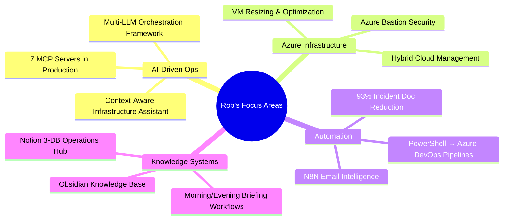

<div align="center">

<!-- Animated Banner -->


<!-- Typing Animation -->

[](https://git.io/typing-svg)

<!-- Social Badges -->

<p>
  <a href="https://twitter.com/ogmacson"></a>
  <a href="https://github.com/iloveyouit"></a>
  
  
</p>

</div>

-----

## 🧠 Who Am I?

```yaml
name: Rob Loftin
role: Senior IT Infrastructure & Cloud Consultant | Infrastructure Team Lead
company: Long View Systems (143IT)
location: Calgary, AB (Remote/Hybrid)
experience: 20+ years

team_size: 8-10 specialists
endpoints_managed: 500+
servers_managed: 600+

environment:
  - Hybrid Azure + On-Premises
  - Multi-client MSP Operations
  - AI-Augmented Infrastructure Management

key_clients:
  - GR Energy
  - McLeod
  - Deer Park
  - Canes Midstream
  - Lab Central

philosophy: "Documentation-first. Automate everything. Let AI do the heavy lifting."
```

-----

## 🚀 Impact By The Numbers

<div align="center">

|📊 Metric                   |🏆 Result                                       |
|:--------------------------|:----------------------------------------------|
|Incident Documentation Time|**42 min → 3 min** (93% reduction)             |
|Deployment Time Reduction  |**93% faster** with automation                 |
|Infrastructure Scale       |**500+ endpoints, 600+ servers**               |
|Team Led                   |**8–10 specialists** across hybrid environments|
|AI Tools Integrated        |**7 MCP servers** in production workflow       |

</div>

-----

## 🛠️ Tech Stack

### ☁️ Cloud & Infrastructure

<p>
  
  
  
  
  
  
</p>

### 🤖 AI & Automation

<p>
  
  
  
  
</p>

### 💻 Languages & Scripting

<p>
  
  
  
  
</p>

### 🪟 Windows & Identity

<p>
  
  
  
  
</p>

### 🔧 DevOps & Monitoring

<p>
  
  
  
  
</p>

-----

## 🎯 What I’m Building Right Now



-----

## 📊 GitHub Stats

<div align="center">
  
  
</div>

<div align="center">
  
</div>

<div align="center">
  
</div>

-----

## 📈 Contribution Graph

<div align="center">
  
</div>

-----

## 🧩 Featured Projects

<div align="center">

[](https://github.com/iloveyouit)

</div>


> 🔒 Most production work lives in private repos — the real wins are in the metrics above.

-----

## 🏅 Certifications & Background

```
📌 20+ Years in Enterprise IT
├── 🖥️  Started as Dell Field Technician
├── 🏦  Financial Services & Title Insurance
├── 🚀  Tech Startups
└── ☁️  MSP Leadership (Current)

🎓 Continuous Learning
├── Azure Infrastructure & Architecture
├── AI/ML Integration in IT Operations
├── HashiCorp Vault & Security Automation
└── Multi-LLM Orchestration Patterns
```

-----

## 💬 Let’s Connect

<div align="center">

<a href="https://twitter.com/ogmacson">
  
</a>
&nbsp;
<a href="https://github.com/iloveyouit">
  
</a>

</div>

-----

<div align="center">


*“Automate the routine. Architect the future. Document everything in between.”*

</div>
